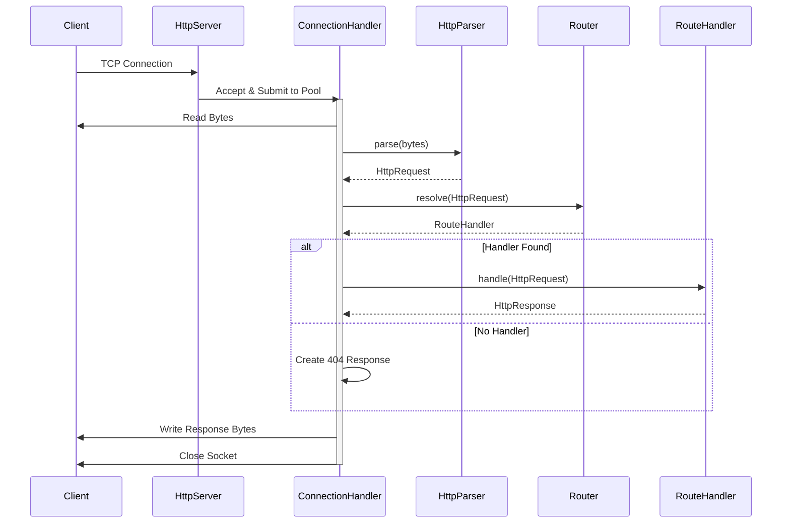

# CoreHTTP - Lightweight Java HTTP Server

## Overview

CoreHTTP is a custom-built, multi-threaded HTTP server implemented entirely in Java without the use of any external web frameworks or libraries. This project demonstrates understanding of the TCP/IP stack, the HTTP/1.1 protocol specifications, socket programming, and low-level system design.

The primary objective of this project is to understand how web servers operate under the hood by building one from scratch, handling everything from raw byte manipulation to request routing and concurrency management.

## Key Features

*   **Zero Dependencies**: Built using only the standard Java Development Kit (JDK 17+).
*   **Multi-threaded Architecture**: Utilizes a fixed thread pool to handle concurrent client connections efficiently, preventing resource exhaustion under load.
*   **Custom HTTP Parser**: Implements a robust parser that converts raw input streams into structured HTTP Request objects, validating headers and methods.
*   **Routing Engine**: Features a flexible routing system allowing dynamic registration of request handlers for specific endpoints.
*   **Static File Serving**: Capable of serving HTML, CSS, and JS files from the classpath, mimicking production-grade web servers.
*   **Robust Error Handling**: meaningful HTTP error responses are generated for invalid requests or server faults.

## Architecture

The project follows a modular design with clear separation of concerns:


### 1. Server Layer
*   **HttpServer**: Manages the life cycle of the ServerSocket. It listens for incoming TCP connections on a specified port and delegates processing to the thread pool.
*   **ConnectionHandler**: Handles the individual client interaction. It reads raw bytes, invokes the parser, resolves the route, and writes the response back to the socket.

### 2. Protocol Layer
*   **HttpParser**: Responsible for lexical analysis of the incoming byte stream. It validates the request line (Method, Path, Version) and parses headers.
*   **HttpRequest / HttpResponse**: Immutable data models representing the state of an HTTP transaction.
*   **HttpStatus**: An enumeration of standard HTTP status codes to ensure consistency.

### 3. Routing Layer
*   **Router**: A registry that maps URL paths to specific execution logic.
*   **RouteHandler**: A functional interface that allows developers to define custom logic for specific endpoints.

## Request Lifecycle

The following sequence diagram illustrates how a request is processed from connection to response:



1.  **Connection**: A client (browser or curl) initiates a TCP connection to the server.
2.  **Accept**: The `HttpServer` accepts the socket and submits the task to the `ExecutorService` (Thread Pool).
3.  **Parse**: The `ConnectionHandler` reads the input stream. The `HttpParser` converts these raw bytes into an `HttpRequest` object.
4.  **Route**: The `Router` inspects the request path.
    *   If a matching `RouteHandler` is found, it is executed.
    *   If no match is found, a 404 handler is triggered.
5.  **Process**: The handler executes business logic (e.g., reading a file or generating a JSON response) and returns an `HttpResponse`.
6.  **Response**: The server serializes the `HttpResponse` object back into bytes and writes them to the client's output stream.
7.  **Termination**: The socket connection is closed (unless Keep-Alive is implemented).

## Getting Started

### Prerequisites
*   Java Development Kit (JDK) 17 or higher.
*   Git (for version control).

### Installation

Clone the repository:
```bash
git clone https://github.com/jhanvi857/coreHTTP.git
cd coreHTTP
```

### Running the Server

Helper scripts are provided to compile and run the project easily.

**For Windows (PowerShell):**
```powershell
.\scripts\run.ps1
```

**For Linux / macOS (Bash):**
```bash
./scripts/run.sh
```

Once started, the server will listen on port `8080`.

### Verification

Open a web browser or terminal to verify operation:

*   **Browser**: Visit `http://localhost:8080/` to see the served static HTML page.
*   **Terminal**: 
    ```bash
    curl -v http://localhost:8080/hello
    ```

## Project Structure

```text
src/
├── main/
│   ├── java/com/jhanvi857/coreHTTP/
│   │   ├── exception/      # Custom exceptions (e.g., ClientDisconnected)
│   │   ├── protocol/       # HTTP Request/Response models and Parser
│   │   ├── routing/        # Router and Handler interfaces
│   │   └── server/         # Core TCP server and Connection management
│   └── resources/
│       └── public/         # Static assets (HTML, CSS, JS)
scripts/
├── run.ps1                 # Windows build/run script
└── run.sh                  # Linux/Mac build/run script
```

## Future Enhancements

*   **HTTP/1.1 Keep-Alive**: Reusing TCP connections for multiple requests to improve performance.
*   **Dynamic Content**: Support for templates to render dynamic HTML.
*   **Logging System**: Replace standard output with a proper logging framework like SLF4J.
*   **Configuration**: Load port numbers and thread pool size from an external properties file.

---

**CoreHTTP** stands as a testament to first-principles thinking in software engineering, providing a transparent, dependency-free implementation of the machinery that powers the modern web.
