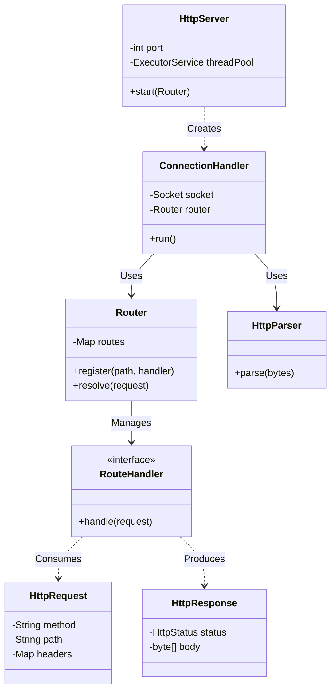

# CoreHTTP - Lightweight Java HTTP Server

## Overview

CoreHTTP is a custom-built, dependency-free HTTP server in Java (JDK 17+).  
It is designed for learning and practical backend/frontend integration, while keeping the internals simple and transparent.

This implementation includes core security and reliability hardening for request parsing, static file serving, and overload handling.

## Key Features

* **Zero Runtime Dependencies**: Built with the Java standard library.
* **Concurrent Request Handling**: Thread pool with bounded queue backpressure.
* **Custom HTTP Parsing**: Supports `Content-Length` and `Transfer-Encoding: chunked` bodies.
* **Secure Static Serving**: Normalized path resolution with traversal protection.
* **Flexible Routing**: Route registration via a lightweight handler interface.
* **Operational Controls**: Configurable threads, queue capacity, socket timeout, and static asset directory.

## Security and Reliability Improvements

The following hardening changes are implemented in the current codebase:

1. **Chunked Request Body Support + Framing Validation**
   * Added chunk-size parsing, CRLF framing checks, trailer handling, and body size limits.
   * Rejects ambiguous `Transfer-Encoding` + `Content-Length` combinations.

2. **Static File Traversal Defense**
   * Replaced naive string checks with normalized path boundary validation.
   * Added URL path decoding and query stripping before file resolution.
   * Added `X-Content-Type-Options: nosniff` for safer browser behavior.

3. **Timeout + Backpressure Under Load**
   * Added socket read timeout to reduce slow-client resource exhaustion.
   * Replaced unbounded task queue behavior with bounded queue and overload rejection (`503`).
   * Returns `408 Request Timeout` for timed-out client reads.

## Architecture

The project follows a modular design with clear separation of concerns:



### Request Lifecycle

1. A client opens a TCP connection.
2. `HttpServer` accepts the socket and applies read timeout.
3. The connection is submitted to a bounded executor queue.
4. `ConnectionHandler` parses the HTTP request and resolves route handler.
5. Route logic returns `HttpResponse`.
6. Response bytes are written to the socket and the connection is closed.

## Getting Started

### Prerequisites

* Java Development Kit (JDK) 17+
* Git

### Clone

```bash
git clone https://github.com/jhanvi857/coreHTTP.git
cd coreHTTP
```

### Run

**Windows (PowerShell)**
```powershell
.\scripts\run.ps1
```

**Linux/macOS (Bash)**
```bash
./scripts/run.sh
```

Default server port is `8080`.

### Verify

* Browser: `http://localhost:8080/`
* API sample:
  ```bash
  curl -v http://localhost:8080/hello
  ```

## Runtime Configuration

CoreHTTP reads settings from JVM properties first, then environment variables:

| Purpose | JVM Property | Environment Variable | Default |
|---|---|---|---|
| Static file root | `corehttp.staticDir` | `COREHTTP_STATIC_DIR` | Auto-resolved (`src/main/resources/public` / `target/public` candidates) |
| Worker threads | `corehttp.threads` | `COREHTTP_THREADS` | `10` |
| Queue capacity | `corehttp.queueCapacity` | `COREHTTP_QUEUE_CAPACITY` | `100` |
| Socket read timeout (ms) | `corehttp.socketTimeoutMs` | `COREHTTP_SOCKET_TIMEOUT_MS` | `15000` |

Example:

```bash
java -Dcorehttp.staticDir="C:/apps/frontend/dist" -Dcorehttp.threads=20 -Dcorehttp.queueCapacity=200 -Dcorehttp.socketTimeoutMs=15000 -cp out com.jhanvi857.coreHTTP.server.HttpServer
```

## Using CoreHTTP in Other Projects

If you want to connect a separate Java backend to your frontend:

1. Reuse `Router` and `RouteHandler` to register your endpoints.
2. Return JSON using `HttpResponse` with `Content-Type: application/json`.
3. Point `corehttp.staticDir` to your frontend build output (`dist`, `build`, etc.).

Minimal example concept:

* Route: `/api/users`
* Handler: fetch data from your service layer
* Response: serialized JSON body with status `200`

## Project Structure

```text
src/
├── main/
│   ├── java/com/jhanvi857/coreHTTP/
│   │   ├── exception/
│   │   ├── protocol/
│   │   ├── routing/
│   │   └── server/
│   └── resources/
│       └── public/
scripts/
├── run.ps1
└── run.sh
```

## Current Limitations

To keep scope intentionally lightweight, the following are not implemented yet:

* HTTPS/TLS termination
* Authentication/authorization middleware
* Keep-Alive and connection reuse
* HTTP/2 support
* Structured logging framework

## Future Enhancements

* Keep-Alive support
* Better routing semantics (method-aware patterns)
* Graceful shutdown hooks
* Optional integration with structured logging (SLF4J)
* Publishable Maven artifact for dependency-based reuse

---

CoreHTTP provides a clear, practical foundation for understanding HTTP server internals while being usable for small full-stack Java experiments and demos.
