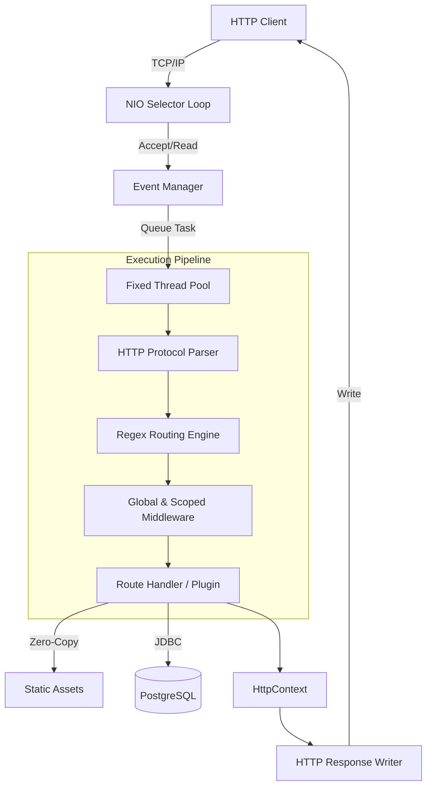
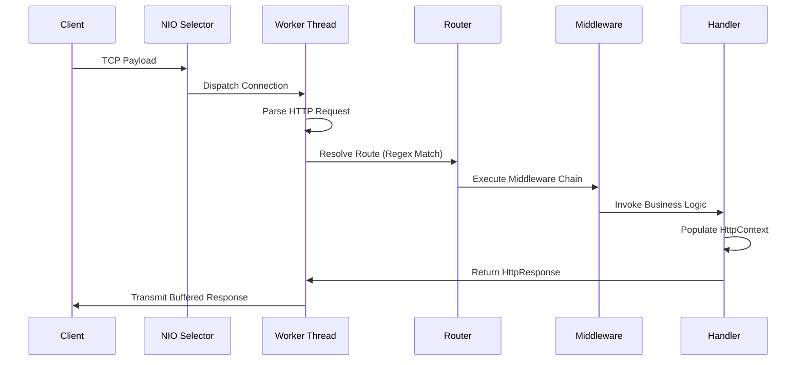

# NioFlow Micro-Framework

NioFlow is a lightweight, modular HTTP framework for Java 17 designed for building programmatic, explicit web applications. It leverages Java Non-blocking I/O (NIO) for connection tracking to provide an alternative to traditional servlet containers, prioritizing explicit endpoint mapping over hidden reflection.

## Quick Start

```java
NioFlowApp app = new NioFlowApp();

app.use(new LoggerMiddleware());
app.use(new CorsMiddleware("*"));

app.get("/", ctx -> ctx.send("Hello World"));
app.post("/api/tasks", taskController::create);

app.group("/api/admin", group -> {
    group.use(new JwtAuthMiddleware());
    group.get("/stats", adminController::stats);
    group.delete("/tasks/:id", adminController::deleteTask);
});

app.listen(8080);
```

## Core Framework Features

### NIO Connection Handling
The core transport layer utilizes `java.nio` to implement an event-driven loop for connection tracking. By using a single `Selector` for connection acceptance, the system restricts the Thread Pool to active I/O readers rather than idling connections.

### Declarative Routing
The routing engine supports basic parameter matching.
- Named Parameters: `/api/resources/:id`
- Wildcard Support: `/assets/*`
- Path-based Grouping: Prefixed groups with scoped middleware.

### Direct File Channel Serving
For asset delivery, the framework utilizes `java.nio.channels.FileChannel.transferTo()`. This instructs the operating system to transfer data directly from the file system to the network socket.

### Unified HttpContext Abstraction
The `HttpContext` provides a unified interface for request data extraction and response generation.
- Type-safe JSON deserialization via `ctx.body(Class<T>)`.
- Fluent response building: `ctx.status(201).json(data)`.
- Path parameter retrieval via `ctx.pathParam(name)`.

## Architectural Overview

The framework uses a hybrid non-blocking and blocking architecture. It separates connection acceptance from request processing. A single selector thread manages accepting concurrent connections, then dispatches the socket channels to a worker thread pool for blocking I/O request parsing.

### System Architecture


```mermaid
graph TD
    Client[HTTP Client] -->|TCP/IP| Selector[NIO Selector Loop]
    Selector -->|Accept/Read| EventManager[Event Manager]
    EventManager -->|Queue Task| WorkerPool[Fixed Thread Pool]
    
    subgraph Execution Pipeline
        WorkerPool --> Parser[HTTP Protocol Parser]
        Parser --> Router[Regex Routing Engine]
        Router --> MiddlewareChain[Global & Scoped Middleware]
        MiddlewareChain --> Handler[Route Handler / Plugin]
    end
    
    Handler -->|Zero-Copy| FileSystem[Static Assets]
    Handler -->|JDBC| Database[(PostgreSQL)]
    
    Handler --> Context[HttpContext]
    Context --> Responder[HTTP Response Writer]
    Responder -->|Write| Client
```

### Request Processing Lifecycle

The lifecycle of a request in NioFlow follows a deterministic path through the middleware pipeline and routing engine.


```mermaid
sequenceDiagram
    participant C as Client
    participant S as NIO Selector
    participant W as Worker Thread
    participant R as Router
    participant M as Middleware
    participant H as Handler

    C->>S: TCP Payload
    S->>W: Dispatch Connection
    W->>W: Parse HTTP Request
    W->>R: Resolve Route (Regex Match)
    R->>M: Execute Middleware Chain
    M->>H: Invoke Business Logic
    H->>H: Populate HttpContext
    H->>W: Return HttpResponse
    W->>C: Transmit Buffered Response
```

## Repository Structure

The project is organized as a Multi-Module Maven repository to ensure strict isolation between the framework core and consumer applications.

```text
.
├── nioflow-framework/       # Reusable framework logic (NIO, Parser, Router)
│   ├── protocol/             # HTTP/1.1 Model and Parsing
│   ├── routing/              # Regex Engine and Context logic
│   ├── server/               # NIO Selector and Connection Management
│   └── plugin/               # Official Extension Points
└── task-planner-app/         # Reference Implementation
    ├── controller/           # REST Handlers
    └── repository/           # PostgreSQL Integration
```

## Deployment and Usage

### Prerequisites
- Java Development Kit (JDK) 17 or higher
- Apache Maven 3.9+

### Installation
To include the framework in a local environment:

```bash
cd nioflow-framework
mvn clean install
```

### Reference Implementation
A sample CRUD application utilizing the framework is available in the `task-planner-app` directory.

```bash
cd task-planner-app
mvn compile exec:java -Dexec.mainClass=com.jhanvi857.taskplanner.DemoApplication
```

## Security and Resilience

- **Path Traversal Protection**: Resolution logic validates canonical paths against the configured base directory.
- **Payload Constraints**: Configurable limits on header size (8KB) and body size (10MB) to mitigate buffer-based attacks.
- **Resource Management**: Bounded thread pools and request queues prevent resource exhaustion under denial-of-service conditions.
- **Rate Limiting**: Configurable window duration and request cap via `RateLimitMiddleware(maxRequests, windowDuration)`. Sliding window implementation for per-IP request throttling.

## Technical Specifications

| Component | Implementation Detail |
|:---|:---|
| Protocol | HTTP/1.1 (Persistent Connections) |
| I/O Model | Java Non-blocking I/O (NIO) |
| Concurrency | Fixed ThreadPool Executor |
| Routing | Regex-based Pattern Matching |
| Serialization | Jackson (JSON) |
| Logging | SLF4J with Logback |
