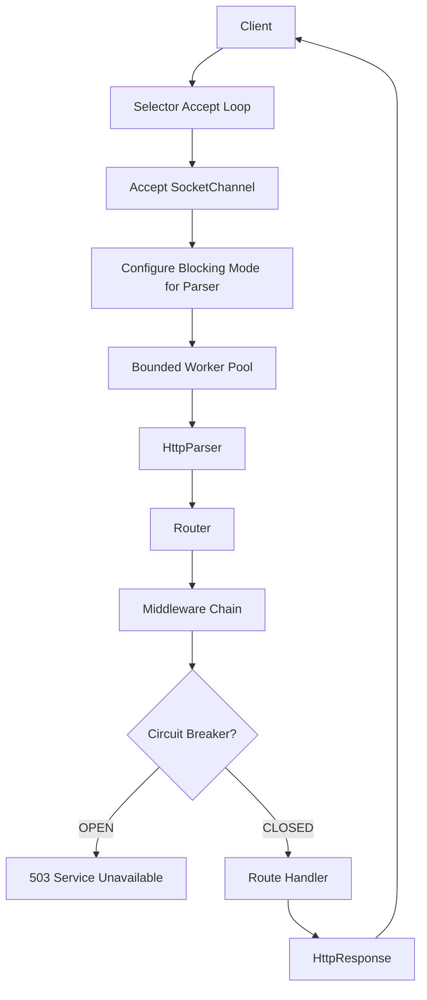

# NioFlow

A lightweight Java 17 HTTP micro-framework with explicit routing, middleware composition, and production-focused runtime controls.

[Java 17+](https://openjdk.org/projects/jdk/17/) | [Maven 3.9+](https://maven.apache.org/) | [Coverage: Pending](#) | [License: MIT](LICENSE) | [Release: v1.3.0](https://github.com/jhanvi857/coreHTTP/releases/tag/v1.3.0) | [NPM: @jhanvi857/nioflow-cli](https://www.npmjs.com/package/@jhanvi857/nioflow-cli)

NioFlow is designed around one principle: make HTTP internals understandable without sacrificing production behavior. Instead of hiding complexity behind annotations and reflection-heavy bootstrapping, NioFlow keeps transport, parsing, routing, middleware, and error handling explicit and testable.

---

## Table of Contents

- [What NioFlow Is](#what-nioflow-is)
- [Architecture Deep Dive](#architecture-deep-dive)
- [NioFlow CLI (Recommended)](#nioflow-cli-recommended)
- [Step-by-Step Quick Start](#step-by-step-quick-start)
- [Framework Programming Model](#framework-programming-model)
- [Advanced Feature Pack](#advanced-feature-pack)
- [Security Model](#security-model)
- [Configuration Matrix](#configuration-matrix)
- [Database Integration](#database-integration)
- [Repository Structure](#repository-structure)
- [Performance Benchmarks](#performance-benchmarks)
- [Roadmap](#roadmap)

---

## What NioFlow Is

NioFlow is a high-performance system composed of:
1. **nioflow-framework:** The core reusable HTTP engine.
2. **task-planner-app:** A reference implementation demonstrating production patterns.

| Concern | NioFlow Approach | Impact |
|:---|:---|:---|
| Connection Accept | NIO Selector Loop | High scalability with minimal idle overhead. |
| Request Handling | Bounded Worker Pool | Predictable performance under high load. |
| Routing | Explicit Programmatic Routes | Type-safe debugging and refactoring. |
| Middleware | Global and Group Scoped | Clean policy layering (Auth, CORS, Rate Limits). |
| Error Handling | Per-type Handlers | Prevents internal stack trace leakage. |
| Lifecycle | Graceful Drain and Stop | Safe rolling deployments. |

---

## Architecture Deep Dive

### Runtime Topology
NioFlow utilizes a tiered architecture to isolate I/O management from business logic.


```mermaid
graph TD
    C[Client] --> SEL[Selector Accept Loop]
    SEL --> ACC[Accept SocketChannel]
    ACC --> BLK[Configure Blocking Mode for Parser]
    BLK --> WP[Bounded Worker Pool]
    WP --> HP[HttpParser]
    HP --> RT[Router]
    RT --> MW[Middleware Chain]
    MW --> CB{Circuit Breaker?}
    CB -- OPEN --> 503[503 Service Unavailable]
    CB -- CLOSED --> H[Route Handler]
    H --> RESP[HttpResponse]
    RESP --> C
```

---

## NioFlow CLI (Recommended)

The CLI is the primary management tool for NioFlow projects. It handles scaffolding, environment orchestration, and hot-reloading.

### 1. Installation
Requires Node.js and JDK 17+.

```bash
npm install -g @jhanvi857/nioflow-cli
```

### 2. Command Reference

| Command | Usage | Description |
| :--- | :--- | :--- |
| **new** | `nioflow new <project-name>` | Scaffolds a production-ready project with security defaults. |
| **dev** | `nioflow dev` | Starts the server with a file watcher for instant hot-reloading. |
| **run** | `nioflow run` | Compiles and executes the application in standard mode. |
| **help** | `nioflow --help` | Displays version info and command documentation. |

---

## Step-by-Step Quick Start

### 1. Scaffolding
Create a new project and navigate to the root directory.

```bash
nioflow new my-app
cd my-app
```

### 2. Environment Setup
The CLI generates a `.env` file automatically.

```env
PORT=8080
JWT_SECRET=your-random-32-char-secret
NIOFLOW_CORS_ORIGIN=http://localhost:3000
```

### 3. Writing Your First Route
Open `App.java` and define a basic endpoint.

```java
public class App {
    public static void main(String[] args) {
        NioFlowApp app = new NioFlowApp();
        app.get("/api/status", ctx -> ctx.json(Map.of("status", "online")));
        app.listen(8080);
    }
}
```

### 4. Running the Application
```bash
nioflow dev
```

---

## Framework Programming Model

### Middleware Pipeline
Middleware executes in registration order and is wrapped around each resolved route handler.

```java
app.use(new LoggerMiddleware());
app.use(new CorsMiddleware("https://yourdomain.com"));
app.use(new RateLimitMiddleware(100, 10_000));
```

### Global Error Control
```java
app.exception(IllegalArgumentException.class, (e, ctx) -> {
    ctx.status(400).json(Map.of("error", "Bad Request", "details", e.getMessage()));
});

app.onError((err, ctx) -> {
    ctx.status(500).json(Map.of("error", "Internal Server Error"));
});
```

---

## Advanced Feature Pack

| Feature | Description | Implementation |
|:---|:---|:---|
| **Chaos Injection** | Controlled fault injection. | `app.use(new ChaosMiddleware().latency(200, 0.1))` |
| **Route Protection** | Granular per-route limits. | `route.timeout(2000).rateLimit(50, 10_000)` |
| **Request Hedging** | Tail-latency reduction. | `route.hedge(100)` |
| **Circuit Breaker** | Cascading failure prevention. | `group.use(new CircuitBreakerMiddleware())` |
| **Request Replay** | Fast local debugging. | `app.enableReplay(50)` |

---

## Security Model

| Control | Implementation |
|:---|:---|
| Authentication | JWT via `AuthMiddleware` and `JwtProvider`. |
| Password Security | Argon2 hashing via `PasswordHasher`. |
| Protocol Security | Native TLS support via `listenSecure`. |
| Request Hardening | 8KB Header Cap, 10MB Body Cap, Sanitized Errors. |

---

## Configuration Matrix

| Variable | Required | Default | Purpose |
|:---|:---|:---|:---|
| `PORT` | No | `8080` | Server listener port. |
| `JWT_SECRET` | Yes | None | Secret for JWT signing (min 32 chars). |
| `NIOFLOW_CORS_ORIGIN`| No | `http://localhost:3000` | Allowed CORS origin. |
| `NIOFLOW_CHAOS_ENABLED`| No | `false` | Enable/Disable Chaos middleware. |
| `NIOFLOW_WATCH` | No | `false` | Enable/Disable Hot Reload mode. |
| `NIOFLOW_LOG_FORMAT` | No | `plain` | Set to `json` for structured logging. |

---

## Database Integration

NioFlow provides a centralized `Database` utility to manage persistence with zero boilerplate.

```java
NioFlowApp app = new NioFlowApp();
app.initPostgres(); // Reads from .env automatically

try (Connection conn = Database.getPostgresConnection()) {
    // Standard JDBC logic
}
```

---

## Repository Structure

```text
.
├── nioflow-framework/       # Core HTTP engine
├── nioflow-cli/             # Java-based CLI source
├── nioflow-cli-npm/         # Node.js CLI distribution
├── task-planner-app/        # Reference implementation
├── documentation/nioflow/   # Next.js docs portal
└── scripts/                 # Benchmarking and ops scripts
```

---

## Performance Benchmarks

Measured using k6 (v1.7.1) against the v1.3.0 health endpoint.

| Metric | Result |
| :--- | :--- |
| **Throughput** | **501.12 requests/second** |
| **Median Latency (p50)** | **1.52 ms** |
| **Tail Latency (p99)** | **74.62 ms** |
| **Success Rate** | **99.84%** |

---

## Roadmap

1.  **CLI Tooling:** Global NPM distribution and scaffolding. (Completed)
2.  **Structured Observability:** JSON logging and Prometheus. (Completed)
3.  **OpenAPI Generation:** Automated Swagger/OpenAPI specs. (In Progress)
4.  **RBAC Support:** Native role-based access control. (Planned)

---

**Authored by Jhanvi Patel**
[Official Documentation](https://nioflow-docs.vercel.app)
