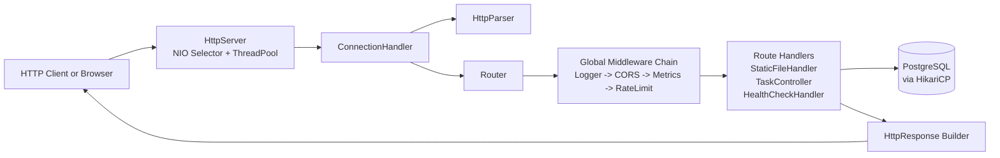
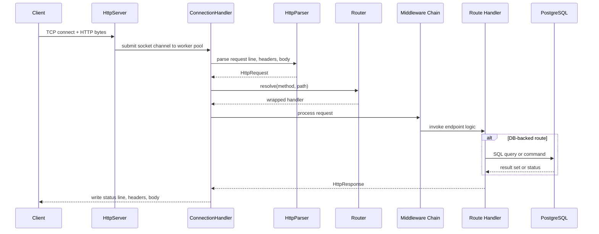
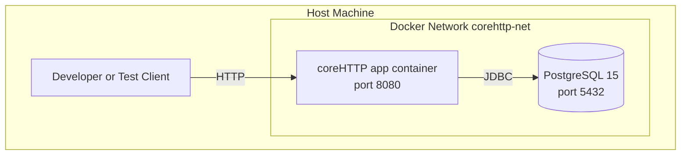

# CoreHTTP

Custom HTTP server built from scratch in Java 17 using NIO, with routing, middleware, static file serving, optional PostgreSQL-backed CRUD APIs, and observability endpoints.

## Table of Contents

- [Project Summary](#project-summary)
- [Core Capabilities](#core-capabilities)
- [Architecture](#architecture)
- [Request Flow](#request-flow)
- [Deployment Topology](#deployment-topology)
- [Repository Structure](#repository-structure)
- [Quick Start](#quick-start)
- [API Reference](#api-reference)
- [Configuration](#configuration)
- [Operational Notes](#operational-notes)
- [Current Limitations](#current-limitations)
- [Roadmap](#roadmap)

## Project Summary

CoreHTTP is a custom Java HTTP server built for understanding server internals while supporting realistic backend requirements.

The codebase combines:

- A non-blocking accept loop using Java NIO (`Selector` + `ServerSocketChannel`).
- Worker-thread request processing via a bounded `ThreadPoolExecutor`.
- A routing layer with composable middleware (function wrapping pattern).
- Static file delivery with path traversal protection and zero-copy file transfer (`FileChannel.transferTo`).
- Optional PostgreSQL-backed task APIs using HikariCP connection pooling (disabled by default).
- Health and metrics endpoints for operational visibility.

## Core Capabilities

- HTTP/1.1 request parsing with `Content-Length` and `Transfer-Encoding: chunked` support.
- Header size limit (8 KB) and body size limit (10 MB) to prevent oversized payloads.
- Validation for malformed request framing (negative lengths, dual Content-Length + chunked, bad CRLF boundaries).
- Path-normalized static file resolution with traversal detection (`normalize()` + `startsWith()` guard).
- Global middleware chain: `Logger`, `CORS`, `Metrics`, `RateLimit`.
- Longest-prefix route matching for patterns like `/api/tasks/{id}`.
- Docker Compose stack for app + PostgreSQL (requires `DB_PASS` env var).

## Architecture

Each package has a focused responsibility and clear integration points.


```mermaid
flowchart LR
    client[HTTP Client or Browser]
    server[HttpServer\nNIO Selector + ThreadPool]
    handler[ConnectionHandler]
    parser[HttpParser]
    router[Router]
    middleware[Global Middleware Chain\nLogger -> CORS -> Metrics -> RateLimit]
    endpoints[Route Handlers\nStaticFileHandler\nTaskController\nHealthCheckHandler]
    protocol[HttpResponse Builder]
    db[(PostgreSQL\nvia HikariCP)]

    client --> server
    server --> handler
    handler --> parser
    handler --> router
    router --> middleware
    middleware --> endpoints
    endpoints --> db
    endpoints --> protocol
    protocol --> client
```

### Layer Responsibilities

- `server`: connection acceptance, selector lifecycle, worker pool, overload control.
- `protocol`: HTTP model objects, parser, status and response writing.
- `routing`: route registration and request-to-handler resolution.
- `middleware`: cross-cutting request processing (logging, CORS, metrics, rate limiting).
- `app`: business logic (`TaskController`, `TaskRepository`, `Task` model).
- `db`: datasource bootstrap and connection acquisition via HikariCP.
- `observability`: runtime health and metrics endpoints.
- `auth`: JWT token generation/validation and BCrypt password hashing (utilities available, not wired into routes yet).
- `exception`: parse and handler error types used by the protocol and connection layers.

## Request Flow


```mermaid
sequenceDiagram
    participant C as Client
    participant S as HttpServer
    participant W as ConnectionHandler
    participant P as HttpParser
    participant R as Router
    participant M as Middleware Chain
    participant H as Route Handler
    participant D as PostgreSQL

    C->>S: TCP connect + HTTP bytes
    S->>W: submit socket channel to worker pool
    W->>P: parse request line, headers, body
    P-->>W: HttpRequest
    W->>R: resolve(method, path)
    R-->>W: wrapped handler
    W->>M: process request
    M->>H: invoke endpoint logic
    alt DB-backed route
        H->>D: SQL query or command
        D-->>H: result set or status
    end
    H-->>W: HttpResponse
    W-->>C: write status line, headers, body
```

## Deployment Topology

For containerized execution, `docker-compose.yml` defines the following topology:


```mermaid
flowchart TD
    subgraph Host Machine
        subgraph Docker Network corehttp-net
            APP[coreHTTP app container\nport 8080]
            DB[(PostgreSQL 15\nport 5432)]
        end
        USER[Developer or Test Client]
    end

    USER -->|HTTP| APP
    APP -->|JDBC| DB
```

## Repository Structure

```text
src/main/java/com/jhanvi857/coreHTTP/
  app/
    controller/      TaskController (CRUD handlers)
    model/           Task data class
    repository/      TaskRepository (SQL via PreparedStatement)
  auth/              JwtProvider, PasswordHasher (utility classes, not yet route-integrated)
  db/                DatabaseManager (HikariCP bootstrap)
  exception/         HttpParseException, GlobalExceptionHandler
  middleware/        Logger, CORS, Metrics, RateLimit middleware
  observability/     HealthCheckHandler
  protocol/          HttpParser, HttpRequest, HttpResponse, HttpStatus
  routing/           Router, RouteHandler interface
  server/            HttpServer (NIO), ConnectionHandler, StaticFileHandler, FileHttpResponse
  util/              JsonUtils (Jackson wrapper)
src/main/resources/public/    Static web assets
src/test/                     JUnit 5 tests for HttpParser
scripts/                      run.ps1, run.sh convenience scripts
```

## Quick Start

### Prerequisites

- JDK 17+
- Maven 3.9+
- PostgreSQL 15+ (only if using task APIs, disabled by default)

### Option 1: Run via Maven (recommended)

```bash
mvn clean compile
mvn exec:java -Dexec.mainClass=com.jhanvi857.coreHTTP.server.HttpServer
```

### Option 2: Convenience scripts

Windows PowerShell:

```powershell
.\scripts\run.ps1
```

Linux or macOS Bash:

```bash
./scripts/run.sh
```

### Option 3: Docker Compose

Requires setting `DB_PASS`:

```bash
DB_PASS=yourpassword docker-compose up --build
```

### Smoke Tests

```bash
curl -i http://localhost:8080/
curl -i http://localhost:8080/_health
curl -i http://localhost:8080/metrics
```

## API Reference

| Method | Path | Description |
|---|---|---|
| `GET` | `/` | Serves static content from configured public directory. |
| `GET` | `/_health` | Returns server and database health summary (JSON). |
| `GET` | `/metrics` | Returns Prometheus-style counters and latency gauges. |
| `GET` | `/api/tasks` | List all tasks (requires DB enabled). |
| `POST` | `/api/tasks` | Create a task from JSON body (requires DB enabled). |
| `GET` | `/api/tasks/{id}` | Fetch task by id (requires DB enabled). |
| `DELETE` | `/api/tasks/{id}` | Delete task by id (requires DB enabled). |
| `GET` | `/api/secure` | Demo endpoint that reads `X-Auth-User` header. No authentication is enforced. |

Example create request (with database enabled):

```bash
curl -i -X POST http://localhost:8080/api/tasks \
  -H "Content-Type: application/json" \
  -d '{"title":"Write architecture docs","completed":false}'
```

## Configuration

CoreHTTP reads JVM properties first, then environment variables.

### Server Runtime

| Purpose | JVM Property | Environment Variable | Default |
|---|---|---|---|
| Static file root | `corehttp.staticDir` | `COREHTTP_STATIC_DIR` | Auto-detected candidate path |
| Worker threads | `corehttp.threads` | `COREHTTP_THREADS` | `10` |
| Queue capacity | `corehttp.queueCapacity` | `COREHTTP_QUEUE_CAPACITY` | `100` |
| Socket read timeout (ms) | `corehttp.socketTimeoutMs` | `COREHTTP_SOCKET_TIMEOUT_MS` | `15000` |
| CORS allowed origin | — | `COREHTTP_CORS_ORIGIN` | `http://localhost:3000` |

### Database Runtime

| Variable | Default | Description |
|---|---|---|
| `COREHTTP_ENABLE_DB` | `false` | Set to `true` to enable PostgreSQL features (task CRUD, health check DB probe). |
| `JDBC_URL` | `jdbc:postgresql://localhost:5432/corehttp` | PostgreSQL JDBC URL. |
| `DB_USER` | `postgres` | Database username. |
| `DB_PASS` | *(required when DB enabled)* | Database password. No default — must be set explicitly. |

### Auth (not yet route-integrated)

| Variable | Default | Description |
|---|---|---|
| `JWT_SECRET` | *(required for JWT ops)* | HMAC-SHA signing key, minimum 32 characters. |

Example launch with explicit runtime settings:

```bash
mvn exec:java \
  -Dexec.mainClass=com.jhanvi857.coreHTTP.server.HttpServer \
  -Dcorehttp.staticDir="C:/apps/frontend/dist" \
  -Dcorehttp.threads=20 \
  -Dcorehttp.queueCapacity=200 \
  -Dcorehttp.socketTimeoutMs=15000
```

## Operational Notes

- **Overload control**: bounded worker queue rejects with HTTP 503 under burst traffic.
- **Parser safety**: rejects ambiguous framing, oversized headers (8 KB), and oversized bodies (10 MB).
- **Metrics model**: request totals, error totals, and per-path average latency with path normalization.
- **Health behavior**: returns `DEGRADED` status when database connectivity fails; reports `DISABLED` when DB is off.
- **Rate limiting**: per-client (via `X-Forwarded-For`) with configurable window and request cap.
- **Zero-copy**: static files are transferred via `FileChannel.transferTo()` to avoid heap copies.

## Current Limitations

- **Auth is not enforced**. `JwtProvider` and `AuthMiddleware` exist as utility classes but are not applied to any route. The `/api/secure` endpoint is a demo stub without real protection.
- **No TLS**. The server accepts plaintext HTTP only. Use a reverse proxy (nginx, Caddy) for HTTPS in production.
- **Single-host rate limiting**. The rate limiter uses in-process memory and does not share state across server instances.
- **No persistent sessions**. There is no session or cookie management built in.

## Roadmap

- Route-level authentication middleware integration.
- Improved route templating with named path parameters.
- Expanded test coverage for protocol edge cases and integration tests.
- Maven shade/assembly plugin for fat JAR Docker builds.
- Optional TLS termination support.
