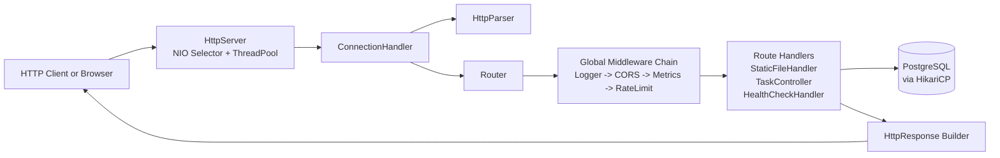
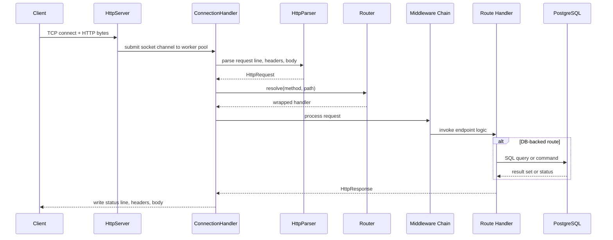
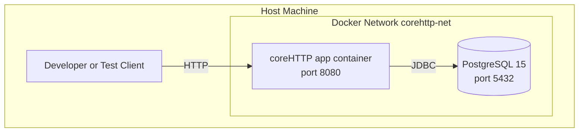

# CoreHTTP

Production-oriented educational HTTP server in Java 17 with routing, middleware, static asset serving, PostgreSQL-backed CRUD APIs, and observability endpoints.

## Table of Contents

- [Project Summary](#project-summary)
- [Core Capabilities](#core-capabilities)
- [Architecture](#architecture)
- [Request Flow](#request-flow)
- [Deployment Topology](#deployment-topology)
- [Repository Structure](#repository-structure)
- [Quick Start](#quick-start)
- [API Reference](#api-reference)
- [Configuration](#configuration)
- [Operational Notes](#operational-notes)
- [Roadmap](#roadmap)

## Project Summary

CoreHTTP is a custom Java HTTP server that focuses on understanding server internals while still supporting realistic backend requirements.

The codebase combines:

- A non-blocking accept loop using Java NIO.
- Worker-thread request processing with bounded queue backpressure.
- A routing layer with composable middleware.
- Static file delivery for browser clients.
- Database-backed task APIs using PostgreSQL and HikariCP.
- Health and metrics endpoints for operational visibility.

## Core Capabilities

- HTTP request parsing with support for `Content-Length` and `Transfer-Encoding: chunked`.
- Validation for malformed request framing and oversized header/body boundaries.
- Path-normalized static file resolution to reduce traversal risk.
- Global middleware support (`Logger`, `CORS`, `Metrics`, and `Rate Limit`).
- Longest-prefix route matching for patterns such as `/api/tasks/{id}`.
- Docker Compose stack for app and PostgreSQL runtime.

## Architecture

The architecture is intentionally modular. Each package has a focused responsibility and clear integration points.


```mermaid
flowchart LR
    client[HTTP Client or Browser]
    server[HttpServer\nNIO Selector + ThreadPool]
    handler[ConnectionHandler]
    parser[HttpParser]
    router[Router]
    middleware[Global Middleware Chain\nLogger -> CORS -> Metrics -> RateLimit]
    endpoints[Route Handlers\nStaticFileHandler\nTaskController\nHealthCheckHandler]
    protocol[HttpResponse Builder]
    db[(PostgreSQL\nvia HikariCP)]

    client --> server
    server --> handler
    handler --> parser
    handler --> router
    router --> middleware
    middleware --> endpoints
    endpoints --> db
    endpoints --> protocol
    protocol --> client
```

### Layer Responsibilities

- `server`: connection acceptance, selector lifecycle, worker pool, overload control.
- `protocol`: HTTP model objects, parser, status and response writing.
- `routing`: route registration and request-to-handler resolution.
- `middleware`: cross-cutting request processing.
- `app`: business logic (`TaskController`, repository, model).
- `db`: datasource bootstrap and connection acquisition.
- `observability`: runtime health and metrics endpoints.

## Request Flow

The sequence below describes a typical API request:


```mermaid
sequenceDiagram
    participant C as Client
    participant S as HttpServer
    participant W as ConnectionHandler
    participant P as HttpParser
    participant R as Router
    participant M as Middleware Chain
    participant H as Route Handler
    participant D as PostgreSQL

    C->>S: TCP connect + HTTP bytes
    S->>W: submit socket channel to worker pool
    W->>P: parse request line, headers, body
    P-->>W: HttpRequest
    W->>R: resolve(method, path)
    R-->>W: wrapped handler
    W->>M: process request
    M->>H: invoke endpoint logic
    alt DB-backed route
        H->>D: SQL query or command
        D-->>H: result set or status
    end
    H-->>W: HttpResponse
    W-->>C: write status line, headers, body
```

## Deployment Topology

For containerized execution, `docker-compose.yml` defines the following topology:


```mermaid
flowchart TD
    subgraph Host Machine
        subgraph Docker Network corehttp-net
            APP[coreHTTP app container\nport 8080]
            DB[(PostgreSQL 15\nport 5432)]
        end
        USER[Developer or Test Client]
    end

    USER -->|HTTP| APP
    APP -->|JDBC| DB
```

## Repository Structure

```text
src/main/java/com/jhanvi857/coreHTTP/
  app/
    controller/
    model/
    repository/
  auth/
  db/
  exception/
  middleware/
  observability/
  protocol/
  routing/
  server/
  util/
src/main/resources/public/
scripts/
documentation/corehttp/   (Next.js documentation site)
```

## Quick Start

### Prerequisites

- JDK 17+
- Maven 3.9+
- PostgreSQL 15+ (for task APIs)

### Option 1: Run via Maven (recommended)

```bash
mvn clean compile
mvn exec:java -Dexec.mainClass=com.jhanvi857.coreHTTP.server.HttpServer
```

### Option 2: Convenience scripts

Windows PowerShell:

```powershell
.\scripts\run.ps1
```

Linux or macOS Bash:

```bash
./scripts/run.sh
```

### Option 3: Docker Compose

```bash
docker-compose up --build
```

### Smoke Tests

```bash
curl -i http://localhost:8080/
curl -i http://localhost:8080/_health
curl -i http://localhost:8080/metrics
```

## API Reference

| Method | Path | Description |
|---|---|---|
| `GET` | `/` | Serves static content from configured public directory. |
| `GET` | `/_health` | Returns server and database health summary. |
| `GET` | `/metrics` | Returns Prometheus-style counters and latency gauges. |
| `GET` | `/api/tasks` | List all tasks. |
| `POST` | `/api/tasks` | Create a task from JSON body. |
| `GET` | `/api/tasks/{id}` | Fetch task by id. |
| `DELETE` | `/api/tasks/{id}` | Delete task by id. |
| `GET` | `/api/secure` | Sample secure-style endpoint using `X-Auth-User` context. |

Example create request:

```bash
curl -i -X POST http://localhost:8080/api/tasks \
  -H "Content-Type: application/json" \
  -d '{"title":"Write architecture docs","completed":false}'
```

## Configuration

CoreHTTP reads JVM properties first, then environment variables.

### Server Runtime

| Purpose | JVM Property | Environment Variable | Default |
|---|---|---|---|
| Static file root | `corehttp.staticDir` | `COREHTTP_STATIC_DIR` | Auto-detected candidate path |
| Worker threads | `corehttp.threads` | `COREHTTP_THREADS` | `10` |
| Queue capacity | `corehttp.queueCapacity` | `COREHTTP_QUEUE_CAPACITY` | `100` |
| Socket read timeout in ms | `corehttp.socketTimeoutMs` | `COREHTTP_SOCKET_TIMEOUT_MS` | `15000` |

### Database Runtime

| Variable | Default | Description |
|---|---|---|
| `JDBC_URL` | `jdbc:postgresql://localhost:5432/corehttp` | PostgreSQL JDBC URL |
| `DB_USER` | `postgres` | Database username |
| `DB_PASS` | `password` | Database password |

Example launch with explicit runtime settings:

```bash
mvn exec:java \
  -Dexec.mainClass=com.jhanvi857.coreHTTP.server.HttpServer \
  -Dcorehttp.staticDir="C:/apps/frontend/dist" \
  -Dcorehttp.threads=20 \
  -Dcorehttp.queueCapacity=200 \
  -Dcorehttp.socketTimeoutMs=15000
```

## Operational Notes

- Overload behavior: bounded worker queue protects memory growth under burst traffic.
- Parser safety: rejects ambiguous framing and malformed chunk boundaries.
- Metrics model: request totals, error totals, and per-path average latency.
- Health behavior: returns degraded status when database connectivity fails.

## Roadmap

- Route-level authentication integration for protected endpoints.
- Improved route templating and parameter extraction.
- Expanded automated test coverage for protocol edge cases.
- Enhanced graceful shutdown with in-flight request draining.
- Optional TLS termination strategy for production deployments.
