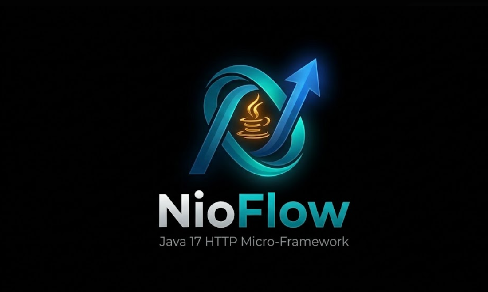
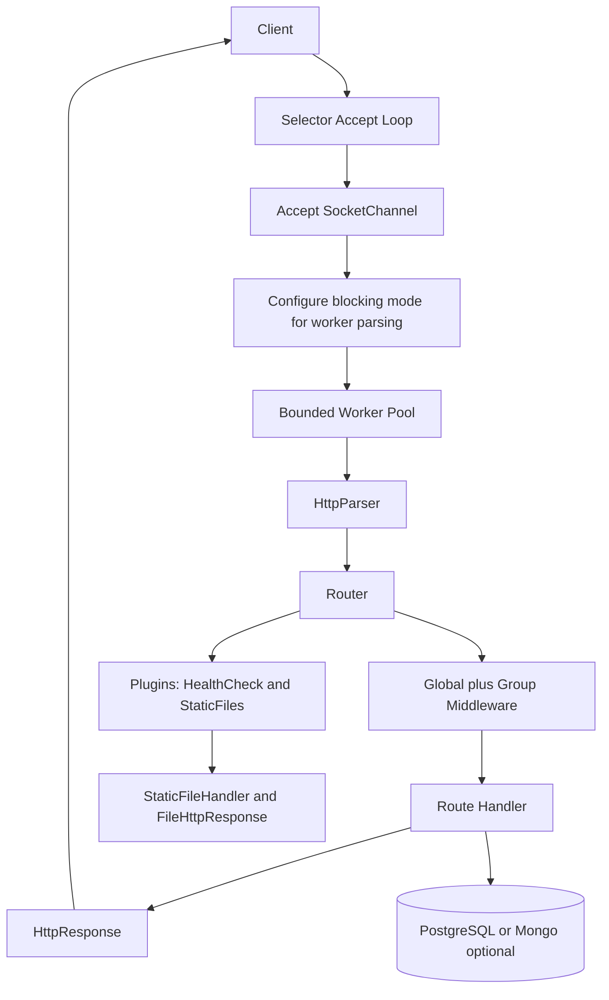
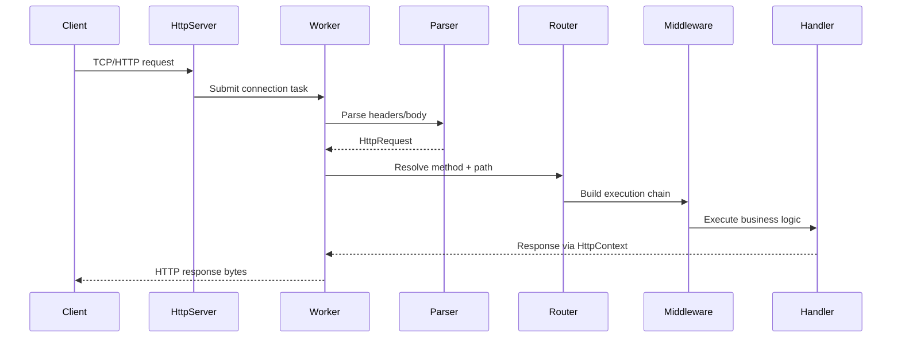

# NioFlow
<p align="center">

</p>
A lightweight Java 17 HTTP micro-framework with explicit routing, middleware composition, and production-focused runtime controls.

[](https://openjdk.org/projects/jdk/17/)
[](https://maven.apache.org/)
[](LICENSE)
[](https://github.com/jhanvi857/coreHTTP/releases/latest)

NioFlow is designed around one principle: make HTTP internals understandable without sacrificing production behavior. Instead of hiding complexity behind annotations and reflection-heavy bootstrapping, NioFlow keeps transport, parsing, routing, middleware, and error handling explicit and testable.

---

## Table of Contents

- [What NioFlow Is](#what-nioflow-is)
- [Key Capabilities](#key-capabilities)
- [Quick Start](#quick-start)
- [Documentation Site](#documentation-site)
- [Framework Programming Model](#framework-programming-model)
- [Advanced Feature Pack](#advanced-feature-pack)
- [Architecture Deep Dive](#architecture-deep-dive)
- [Security Model](#security-model)
- [Configuration Matrix](#configuration-matrix)
- [Deployment Guide](#deployment-guide)
- [Repository Structure](#repository-structure)
- [Roadmap for Production Hardening](#roadmap-for-production-hardening)

---

## What NioFlow Is

NioFlow is a two-part system:

1. `nioflow-framework`: reusable HTTP framework module.
2. `task-planner-app`: reference application that demonstrates how to use the framework in a real service.

It sits between "build a server from scratch" and "adopt a massive framework":

| Concern | NioFlow Approach | Why It Matters |
|:---|:---|:---|
| Connection accept | NIO selector loop | High connection scalability with low idle overhead |
| Request handling | Bounded worker pool | Predictable behavior under load |
| Routing | Explicit code-based routes | Easy debugging and refactoring |
| Middleware | Global + route-group scoped | Clear policy layering (auth, rate limits, CORS) |
| Errors | Per-type handlers + global fallback | No stack trace leakage |
| Shutdown | Graceful draining via `drainAndStop` | Safer rolling restarts |

---

## Key Capabilities

### 1. Explicit Route Registration

```java
NioFlowApp app = new NioFlowApp();

app.get("/", ctx -> ctx.send("Hello"));
app.get("/api/tasks/:id", taskController::get);

app.group("/api/admin", group -> {
    group.use(new AuthMiddleware());
    group.get("/stats", adminController::stats);
});
```

### 2. Middleware Pipeline

```java
app.use(new LoggerMiddleware());
app.use(new CorsMiddleware("https://yourdomain.com"));
app.use(new RateLimitMiddleware(100, 10_000));
```

Middleware executes in registration order and is wrapped around each resolved route handler.

### 3. Global Error Control

```java
app.exception(IllegalArgumentException.class, (e, ctx) -> {
    ctx.status(400).json(Map.of("error", "Bad Request", "details", e.getMessage()));
});

app.onError((err, ctx) -> {
    ctx.status(500).json(Map.of("error", "Internal Server Error"));
});
```

### 4. TLS Entry Point + Graceful Stop

```java
app.listenSecure(443, "keystore.jks", "changeit");

Runtime.getRuntime().addShutdownHook(
    new Thread(() -> app.drainAndStop(30, TimeUnit.SECONDS))
);
```

---

## Quick Start

### Prerequisites

- JDK 17+
- Maven 3.9+

### 0. Configure environment

Create a local `.env` from the example and set a strong JWT secret:

```bash
cp .env.example .env
```

Windows PowerShell alternative:

```powershell
Copy-Item .env.example .env
```

At minimum, set:

- `JWT_SECRET` (32+ characters)
- `NIOFLOW_CORS_ORIGIN` (frontend origin)
- `DB_PASS` (if `NIOFLOW_ENABLE_DB=true`)

### 1. Build all modules

```bash
# From repository root
./mvnw clean test
```

Windows PowerShell alternative:

```powershell
.\mvn.ps1 clean test
```

### 2. Run the reference app

```bash
./mvnw exec:java -pl task-planner-app \
  -Dexec.mainClass=io.github.jhanvi857.taskplanner.DemoApplication \
  -Dnioflow.jwtSecret=your-very-long-secret-at-least-32-chars
```

### 3. Verify endpoints

```bash
curl http://localhost:8080/_health
curl http://localhost:8080/_ready
curl http://localhost:8080/metrics
curl http://localhost:8080/api/tasks/
```

Expected behavior:

- `/_health` returns `200` with JSON payload.
- `/_ready` returns `200` when dependencies are ready (`503` if DB mode is enabled but DB is unavailable).
- `/metrics` returns `200` with metrics report.
- `/api/tasks/` returns `401` without bearer token.

---

## Documentation Site

The repository also includes a dedicated Next.js documentation portal in:

```text
documentation/nioflow
```

Run it locally:

```bash
cd documentation/nioflow
npm install
npm run dev
```

Then open `http://localhost:3000`.

---

## Framework Programming Model

### App Bootstrap Pattern

```java
public class MyService {
    public static void main(String[] args) {
        NioFlowApp app = new NioFlowApp();

        app.use(new LoggerMiddleware());
        app.use(new CorsMiddleware("https://yourdomain.com"));

        app.get("/", ctx -> ctx.send("Service up"));

        app.group("/api/private", group -> {
            group.use(new AuthMiddleware());
            group.get("/profile", profileController::getProfile);
        });

        app.onError((err, ctx) -> {
            ctx.status(500).json(Map.of("error", "Internal Server Error"));
        });

        Runtime.getRuntime().addShutdownHook(
            new Thread(() -> app.drainAndStop(30, TimeUnit.SECONDS))
        );

        app.listen(8080);
    }
}
```

### Route Parameters and Context API

```java
app.get("/api/tasks/:id", ctx -> {
    String id = ctx.pathParam("id");
    String auth = ctx.header("Authorization");

    ctx.status(200).json(Map.of(
        "taskId", id,
        "authorized", auth != null
    ));
});
```

### Async Repository Pattern (JDBC Offload)

```java
public CompletableFuture<Optional<Task>> findById(Long id) {
    return CompletableFuture.supplyAsync(() -> {
        // Blocking JDBC work isolated in dedicated DB executor
        // so request workers are not permanently blocked by DB I/O.
    }, dbExecutor);
}
```

---

## Advanced Feature Pack

NioFlow now includes five opt-in features designed for small teams operating production services without heavy platform infrastructure.

### 1. ChaosMiddleware (controlled fault injection)

```java
app.use(
    new ChaosMiddleware()
        .latency(200, 0.10)
        .error(500, 0.05)
        .drop(0.01)
);
```

- Guarded by `NIOFLOW_CHAOS_ENABLED=true`.
- Logs each injected fault with route and path.
- Supports composable latency, error, and drop behavior.

### 2. Per-route observability and protection (fluent API)

```java
app.get("/api/orders", ordersController::list)
   .timeout(2000)
   .rateLimit(50, 10_000);
```

- Per-route request/error counters.
- Per-route p50/p95/p99 latency (sliding in-memory window).
- Route-scoped timeout and route-scoped rate limit.

### 3. Request hedging for tail-latency reduction

```java
app.get("/api/search", searchController::search)
   .hedge(100);
```

- Fires a backup execution when primary crosses threshold.
- Returns first successful completion.
- Hedge trigger count appears in route-level metrics.

### 4. Route-group scoped circuit breaker middleware

```java
app.group("/api/downstream", group -> {
    group.use(new CircuitBreakerMiddleware()
        .threshold(0.5)
        .windowSize(20)
        .cooldown(10_000));

    group.get("/inventory", inventoryController::read);
});
```

- CLOSED / OPEN / HALF_OPEN states.
- OPEN returns `503` and `Retry-After` header.
- Circuit state is exposed per route-group in `/metrics` output.

### 5. Request replay for fast debugging

```java
app.enableReplay(50);
```

- Guarded by `NIOFLOW_REPLAY_ENABLED=true`.
- Captures recent requests in circular memory buffer.
- `GET /_replay` lists recorded requests.
- `POST /_replay/:index` replays through current live pipeline and returns original vs current response.
- Sensitive headers (`Authorization`, `Cookie`, `X-API-Key`) are stripped automatically.

---

## Architecture Deep Dive

### Runtime Topology


```mermaid
graph TD
    C[Client] --> SEL[Selector Accept Loop]
    SEL --> ACC[Accept SocketChannel]
    ACC --> BLK[Configure blocking mode for worker parsing]
    BLK --> WP[Bounded Worker Pool]
    WP --> HP[HttpParser]
    HP --> RT[Router]
    RT --> MW[Global plus Group Middleware]
    MW --> H[Route Handler]
    H --> RESP[HttpResponse]
    RESP --> C

    H --> DB[(PostgreSQL or Mongo optional)]
    RT --> PLG[Plugins: HealthCheck and StaticFiles]
    PLG --> FS[StaticFileHandler and FileHttpResponse]
```

---

### Request Lifecycle Sequence


```mermaid
sequenceDiagram
    participant Client
    participant HttpServer
    participant Worker
    participant Parser
    participant Router
    participant Middleware
    participant Handler

    Client->>HttpServer: TCP/HTTP request
    HttpServer->>Worker: Submit connection task
    Worker->>Parser: Parse headers/body
    Parser-->>Worker: HttpRequest
    Worker->>Router: Resolve method + path
    Router->>Middleware: Build execution chain
    Middleware->>Handler: Execute business logic
    Handler-->>Worker: Response via HttpContext
    Worker-->>Client: HTTP response bytes
```

### Threading Model

- Accept path: NIO selector thread.
- Request work path: bounded worker pool.
- Database path: dedicated DB executor pool.

This split protects the server from unbounded queue growth and improves backpressure behavior under load.

---

## Security Model

### Authentication

- Protected route groups use `AuthMiddleware`.
- Token format: `Authorization: Bearer <jwt>`.
- JWT key source: `JWT_SECRET` (env) or `-Dnioflow.jwtSecret=...`.
- Startup behavior in reference app: exits if JWT secret is missing or too short.

### Request Hardening

| Control | Current Behavior |
|:---|:---|
| Header size cap | 8 KB maximum |
| Body size cap | 10 MB maximum |
| Unsupported framing | Rejects invalid Transfer-Encoding/Content-Length combos |
| Rate limiting | Per client key with sliding window |
| Error responses | Sanitized with explicit exception handlers |

### CORS Strategy

```java
String corsOrigin = System.getenv("NIOFLOW_CORS_ORIGIN");
if (corsOrigin == null || corsOrigin.isBlank()) {
    corsOrigin = "http://localhost:3000";
}
app.use(new CorsMiddleware(corsOrigin));
```

For production, always set `NIOFLOW_CORS_ORIGIN` to your exact frontend origin.

---

## Configuration Matrix

| Variable / Property | Required | Default | Purpose |
|:---|:---|:---|:---|
| `PORT` | No | `8080` | Server port |
| `JWT_SECRET` | Yes unless auth disabled | None | JWT secret used by `AuthMiddleware` |
| `NIOFLOW_DISABLE_AUTH` | No | `false` | Disable JWT checks for protected groups (dev only) |
| `NIOFLOW_CORS_ORIGIN` | Recommended | `http://localhost:3000` | CORS allow-origin value |
| `NIOFLOW_ENABLE_DB` | No | `false` | Enables DB-backed readiness checks and repository behavior |
| `JDBC_URL` | If DB enabled | `jdbc:postgresql://localhost:5432/nioflow` | PostgreSQL URL |
| `DB_USER` | If DB enabled | `postgres` | PostgreSQL user |
| `DB_PASS` | If DB enabled | None | PostgreSQL password |
| `MONGO_URI` | No | None | Optional MongoDB URI (enables `initMongo`) |
| `NIOFLOW_THREADS` / `nioflow.threads` | No | `64` | Worker pool size in `HttpServer` |
| `NIOFLOW_QUEUE_CAPACITY` / `nioflow.queueCapacity` | No | `1000` | Worker queue capacity for backpressure |
| `NIOFLOW_SOCKET_TIMEOUT_MS` / `nioflow.socketTimeoutMs` | No | `30000` | Socket read timeout per connection |
| `NIOFLOW_TLS_ENABLED` | No | `false` | Enable native TLS listener |
| `NIOFLOW_TLS_KEYSTORE_PATH` | If TLS enabled | None | JKS keystore path |
| `NIOFLOW_TLS_KEYSTORE_PASSWORD` | If TLS enabled | None | Keystore password |
| `NIOFLOW_TLS_PORT` | No | `8443` | Native TLS listener port |
| `NIOFLOW_EXPOSE_ERROR_DETAILS` | No | `false` | Include exception details in error payloads |
| `NIOFLOW_STATIC_DIR` / `nioflow.staticDir` | No | Auto-resolve | Static files directory |
| `NIOFLOW_CHAOS_ENABLED` | No | `false` | Enables `ChaosMiddleware` fault injection |
| `NIOFLOW_REPLAY_ENABLED` | No | `false` | Enables `enableReplay(...)` endpoints |

---

## Database Integration

NioFlow provides a centralized `Database` utility to manage your persistence layers with zero boilerplate.

### 1. PostgreSQL (Supabase / Local)
Initialize and get connections directly:
```java
NioFlowApp app = new NioFlowApp();
// Reads JDBC_URL from .env
app.initPostgres(); 

try (Connection conn = Database.getPostgresConnection()) {
    // Standard JDBC logic
}
```

### 2. MongoDB (Atlas / Local, optional)
Initialize and access the document store:
```java
// Reads MONGO_URI from .env
app.initMongo(); 

MongoClient mongo = Database.getMongoClient();
MongoDatabase db = mongo.getDatabase("nioflow");
```

---

## Environment Variable Management

NioFlow includes a built-in `Env` utility that automatically loads configuration from a `.env` file in your project root. This ensures that sensitive keys (like Supabase secrets) remain safe and are not passed via command line arguments.

**Example `.env` file:**
```env
JDBC_URL=jdbc:postgresql://your-db.supabase.co:5432/postgres
DB_USER=postgres
DB_PASS=your-password
JWT_SECRET=your-32-char-secret
PORT=8080
```

---

## Deployment Guide

### Build Artifacts

```bash
./mvnw package -DskipTests -pl task-planner-app -am
```

Primary runnable artifact:

```text
task-planner-app/target/task-planner-app-1.0-SNAPSHOT-jar-with-dependencies.jar
```

### Run as Plain JVM Service (non-Docker)

With the new `.env` support, you no longer need complex `-D` flags:

```bash
java -jar task-planner-app/target/task-planner-app-1.0-SNAPSHOT-jar-with-dependencies.jar
```

### Production Checklist

- [x] Global `onError` handler registered.
- [x] Graceful shutdown hook registered.
- [x] Protected routes gated by `AuthMiddleware`.
- [x] JWT secret validated at startup.
- [x] Integration tests assert auth enforcement and observability endpoints.
- [x] TLS plan finalized (`listenSecure` or reverse proxy termination).
- [x] Runtime sizing validated with reproducible load testing script (`scripts/k6-load-test.js`).
- [x] Vulnerability scanning is enforced in CI for push/PR (`OWASP Dependency Check`).

---

## Repository Structure

```text
.
├── nioflow-framework/
│   └── src/main/java/io/github/jhanvi857/nioflow/
│       ├── auth/            # JWT provider and auth primitives
│       ├── exception/       # Exception handlers and mapping
│       ├── middleware/      # Logger, CORS, auth, rate limit, metrics
│       ├── observability/   # Health handlers
│       ├── plugin/          # Plugin registration points
│       ├── protocol/        # Parser, request, response models
│       ├── routing/         # Route, router, groups, context
│       └── server/          # NIO accept loop and connection handlers
│
├── task-planner-app/
│   └── src/main/java/io/github/jhanvi857/taskplanner/
│       ├── controller/      # HTTP-facing handlers
│       ├── repository/      # JDBC access wrapped in futures
│       ├── db/              # Hikari and DB bootstrap
│       └── DemoApplication.java
│
├── documentation/nioflow/   # Next.js documentation portal
├── .github/workflows/       # CI build/test/security checks
├── Dockerfile               # Multi-stage image build
├── docker-compose.yml       # App + Postgres local stack
└── runbook.md               # Operational procedures
```

---

## Roadmap for Production Hardening

1. Add end-to-end tests with real PostgreSQL in CI service containers.
2. Add structured JSON log output option.
3. Add configurable auth claim mapping for role-based authorization.

---

## Credits & Attribution

This project is authored and maintained by **Jhanvi Patel** (jhanvi857). 

### Dependencies & Third-Party Code
- **Environment Management**: Powered by [dotenv-java](https://github.com/cdimascio/dotenv-java) by **io.github.cdimascio**. Licensed under the [Apache License 2.0](https://www.apache.org/licenses/LICENSE-2.0). 
- **Networking**: Core architectural patterns for the NIO engine were derived from industry-standard high-performance Java server implementations. We honor all original authors and adhere to open-source compliance.

---

## License

This project is licensed under the MIT License - see the [LICENSE](LICENSE) file for details.
