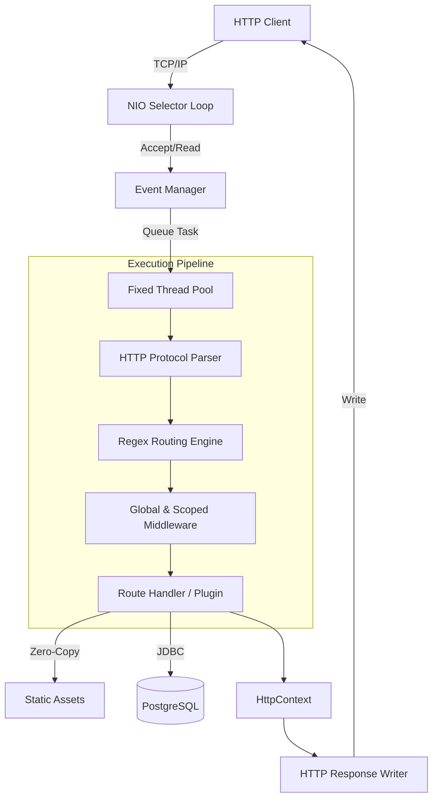
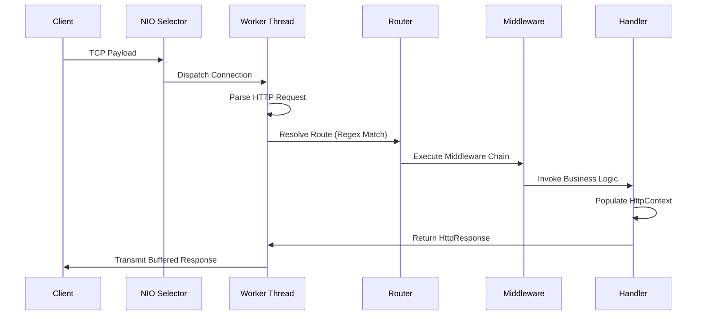

# NioFlow

**A lightweight, production-grade HTTP micro-framework for Java 17.**

NioFlow is built on Java Non-Blocking I/O (NIO) for high-concurrency connection handling, designed as an explicit, low-ceremony alternative to traditional servlet containers. It prioritizes developer clarity, predictable routing, and a composable middleware model, without the overhead of annotation scanning or hidden reflection.

[](https://openjdk.org/projects/jdk/17/)
[](https://maven.apache.org/)
[](LICENSE)
[]()

---

## Table of Contents

- [Why NioFlow](#why-nioflow)
- [Quick Start](#quick-start)
- [Core Features](#core-features)
- [Architecture](#architecture)
- [Security](#security)
- [Configuration Reference](#configuration-reference)
- [Deployment](#deployment)
- [Repository Structure](#repository-structure)
- [Technical Specifications](#technical-specifications)

---

## Why NioFlow

Most Java HTTP frameworks are either too heavyweight (Spring Boot) or too opaque (JAX-RS). NioFlow occupies a deliberate middle ground:

| Concern | NioFlow's Approach |
|:---|:---|
| **Connection handling** | NIO Selector loop ensuring no idle threads per connection |
| **Routing** | Explicit, programmatic configuration without annotation scanning |
| **Middleware** | Composable chain supporting global and route-scoped execution |
| **Security** | Native TLS via `SSLEngine` without requiring a reverse proxy |
| **DB concurrency** | Async JDBC offload via dedicated executor pool |
| **File serving** | Zero-copy transfer via `FileChannel.transferTo()` |

---

## Quick Start

### 1. Add Dependency

```xml
<dependency>
    <groupId>com.jhanvi857</groupId>
    <artifactId>nioflow-framework</artifactId>
    <version>1.0.0</version>
</dependency>
```

### 2. Build Your Application

```java
NioFlowApp app = new NioFlowApp();

// Global middleware
app.use(new LoggerMiddleware());
app.use(new CorsMiddleware("*"));
app.use(new RateLimitMiddleware(100, Duration.ofMinutes(1)));

// Public routes
app.get("/", ctx -> ctx.send("Hello World"));
app.post("/api/tasks", taskController::create);
app.get("/api/tasks/:id", taskController::findById);

// Protected route group with scoped middleware
app.group("/api/admin", group -> {
    group.use(new JwtAuthMiddleware());
    group.get("/stats", adminController::stats);
    group.delete("/tasks/:id", adminController::deleteTask);
});

// Global error handler to prevent stack trace leaks
app.onError((err, ctx) -> {
    logger.error("Unhandled exception", err);
    ctx.status(500).json(new ErrorResponse("Internal Server Error"));
});

// Start with HTTP
app.listen(8080);

// Or start with native HTTPS (no Nginx required)
app.listenSecure(443, "keystore.jks", "password");

// Graceful shutdown on SIGTERM
Runtime.getRuntime().addShutdownHook(
    new Thread(() -> app.drainAndStop(30, TimeUnit.SECONDS))
);
```

---

## Core Features

### 1. NIO Connection Handling

The transport layer uses a single `Selector` thread exclusively for connection acceptance. Accepted connections are dispatched to a bounded worker thread pool for request parsing and processing. This model decouples connection tracking from I/O execution, meaning that idle connections consume no threads.

### 2. HTTPS / TLS (Native)

NioFlow supports TLS natively without requiring an external reverse proxy.

```java
app.listenSecure(443, "keystore.jks", "password");
```

Internally, `NioFlowApp` loads the provided `KeyStore`, constructs an `SSLContext`, and passes it to `HttpServer`. On connection acceptance, the raw `SocketChannel` is upgraded via Java's `SSLSocketFactory` during the NIO-to-worker handoff. No external tooling (Nginx, Caddy) is required for HTTPS termination.

### 3. Declarative Routing

Routes are registered programmatically with explicit path patterns. No annotation scanning occurs at startup.

```java
app.get("/api/resources/:id", controller::findById);   // Named parameter
app.get("/assets/*", staticFileHandler::serve);        // Wildcard
app.group("/api/v2", group -> { ... });                // Prefixed group
```

Supported pattern types:
- **Named Parameters**: `/api/resources/:id` -> `ctx.pathParam("id")`
- **Wildcard Segments**: `/assets/*`
- **Path Groups**: Scoped middleware and shared prefix via `app.group()`

### 4. Async Database Offload

JDBC is inherently synchronous. Executing database queries directly on worker threads blocks those threads for the duration of each query, limiting concurrency under load. NioFlow addresses this by offloading all JDBC operations to a dedicated secondary executor pool inside the repository layer.

```java
// Worker thread returns immediately; DB work runs on dbExecutor
public CompletableFuture<Task> findById(long id) {
    return CompletableFuture.supplyAsync(() -> {
        // JDBC query executes here, on a separate pool
    }, dbExecutor);
}
```

The framework's primary worker threads are never blocked by database I/O. Controllers resolve futures via `.join()` after offload.

### 5. Zero-Copy Static File Serving

Static assets are served using `FileChannel.transferTo()`, which delegates the file-to-socket transfer directly to the operating system kernel. This avoids intermediate copies through the JVM heap and reduces CPU usage for asset delivery.

### 6. Unified HttpContext

Every route handler receives a single `HttpContext` object encapsulating the full request/response lifecycle.

```java
// Request
String id      = ctx.pathParam("id");
TaskDto body   = ctx.body(TaskDto.class);       // Type-safe JSON deserialization
String token   = ctx.header("Authorization");

// Response
ctx.status(201).json(created);                  // Fluent chaining
ctx.status(404).send("Not found");
```

### 7. Middleware Pipeline

Middleware is applied in declaration order. Global middleware applies to every request; scoped middleware applies only within a `group()` block.

```java
app.use(new LoggerMiddleware());                 // Global
app.use(new CorsMiddleware("*"));                // Global

app.group("/api/admin", group -> {
    group.use(new JwtAuthMiddleware());          // Scoped to /api/admin/*
    group.get("/stats", adminController::stats);
});
```

### 8. Global Error Handling

Uncaught exceptions are intercepted at the framework level and routed to a registered handler. This prevents raw stack traces from reaching the client.

```java
app.onError((err, ctx) -> {
    ctx.status(500).json(new ErrorResponse("Internal Server Error"));
});
```

### 9. Graceful Shutdown

NioFlow provides a `drainAndStop` method that signals the thread pool to stop accepting new work and waits for active requests to complete before shutdown.

```java
app.drainAndStop(30, TimeUnit.SECONDS);
```

This ensures zero dropped requests during rolling deployments or container restarts. Integrate with a `ShutdownHook` for automatic invocation on `SIGTERM`.

---

## Architecture

### System Overview

NioFlow uses a hybrid non-blocking and blocking architecture. Connection acceptance is non-blocking (NIO Selector). Request processing is blocking within a bounded worker pool.


```mermaid
graph TD
    Client[HTTP Client] -->|TCP/IP| Selector[NIO Selector Loop]
    Selector -->|Accept/Read| EventManager[Event Manager]
    EventManager -->|Queue Task| WorkerPool[Fixed Thread Pool]
    
    subgraph Execution Pipeline
        WorkerPool --> Parser[HTTP Protocol Parser]
        Parser --> Router[Regex Routing Engine]
        Router --> MiddlewareChain[Global & Scoped Middleware]
        MiddlewareChain --> Handler[Route Handler / Plugin]
    end
    
    Handler -->|Zero-Copy| FileSystem[Static Assets]
    Handler -->|JDBC| Database[(PostgreSQL)]
    
    Handler --> Context[HttpContext]
    Context --> Responder[HTTP Response Writer]
    Responder -->|Write| Client
```

### Request Lifecycle


```mermaid
sequenceDiagram
    participant C as Client
    participant S as NIO Selector
    participant W as Worker Thread
    participant R as Router
    participant M as Middleware
    participant H as Handler

    C->>S: TCP Payload
    S->>W: Dispatch Connection
    W->>W: Parse HTTP Request
    W->>R: Resolve Route (Regex Match)
    R->>M: Execute Middleware Chain
    M->>H: Invoke Business Logic
    H->>H: Populate HttpContext
    H->>W: Return HttpResponse
    W->>C: Transmit Buffered Response
```

---

## Security

| Control | Implementation |
|:---|:---|
| **TLS/HTTPS** | Native `SSLContext` with `SSLSocketFactory` avoiding a reverse proxy requirement |
| **Path Traversal** | Canonical path validation against configured base directory |
| **Header Size Limit** | 8KB maximum to reject oversized headers |
| **Body Size Limit** | 10MB maximum, customizable via configuration |
| **Rate Limiting** | Per-IP sliding window via `RateLimitMiddleware(maxRequests, windowDuration)` |
| **Resource Exhaustion** | Bounded thread pools and request queues cap resource usage under DoS conditions |
| **Error Leakage** | Global `onError` handler sanitizes responses preventing stack traces from reaching the client |

---

## Configuration Reference

### Rate Limiting

```java
// 100 requests per IP per 60-second window
app.use(new RateLimitMiddleware(100, Duration.ofMinutes(1)));
```

Uses a sliding window algorithm for per-IP tracking.

### CORS

```java
app.use(new CorsMiddleware("https://yourdomain.com"));  // Specific origin
app.use(new CorsMiddleware("*"));                       // Open configuration (development only)
```

### Payload Limits

Default limits (overridable via configuration):

| Limit | Default |
|:---|:---|
| Max header size | 8 KB |
| Max body size | 10 MB |

---

## Deployment

### Prerequisites

- Java Development Kit (JDK) 17 or higher
- Apache Maven 3.9+

### Build

```bash
# Build and install framework to local Maven repository
cd nioflow-framework
mvn clean install
```

### Run Reference Application

```bash
cd task-planner-app
mvn compile exec:java -Dexec.mainClass=com.jhanvi857.taskplanner.DemoApplication
```

### Production Checklist

- [ ] Use `listenSecure()` with a valid keystore for HTTPS
- [ ] Register `app.onError()` handler before `listen()`
- [ ] Register `drainAndStop()` in a `ShutdownHook`
- [ ] Configure `RateLimitMiddleware` for public-facing routes
- [ ] Set appropriate thread pool sizes relative to DB connection pool
- [ ] Verify body and header size limits match your payload requirements

---

## Repository Structure

```text
.
├── nioflow-framework/           # Framework core publishable as JAR
│   ├── protocol/                # HTTP/1.1 model and request parsing
│   ├── routing/                 # Regex routing engine and HttpContext
│   ├── server/                  # NIO Selector, TLS, connection management
│   └── plugin/                  # Official extension points
│
└── task-planner-app/            # Reference implementation (CRUD)
    ├── controller/              # REST route handlers
    └── repository/              # Async PostgreSQL integration
```

The framework module (`nioflow-framework`) has no dependency on the application module. It can be packaged and distributed independently as a JAR.

---

## Technical Specifications

| Component | Detail |
|:---|:---|
| Protocol | HTTP/1.1 with persistent connections |
| I/O Model | Java NIO (Non-Blocking I/O) using `java.nio` |
| TLS | Native `SSLContext` and `SSLSocketFactory` |
| Concurrency | Fixed `ThreadPoolExecutor` (worker) with secondary DB executor |
| DB Async | `CompletableFuture.supplyAsync()` with dedicated pool |
| Routing | Regex-based pattern matching |
| File Serving | `FileChannel.transferTo()` (zero-copy) |
| Serialization | Jackson |
| Logging | SLF4J with Logback |
| Java Version | 17+ |
| Build Tool | Maven 3.9+ |

---

## License

MIT License. See [LICENSE](LICENSE) for details.