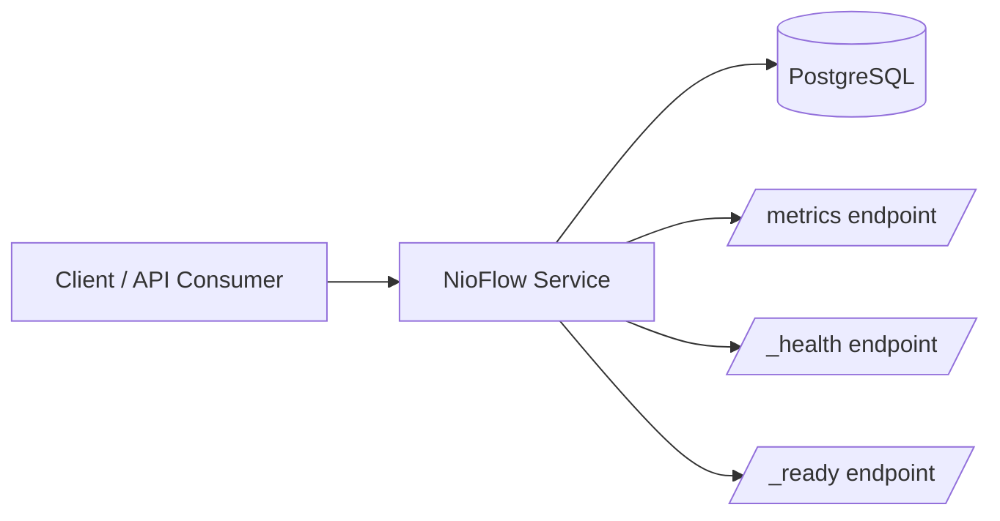
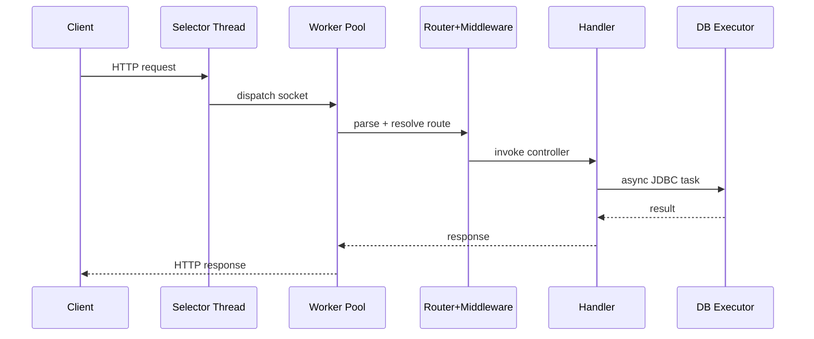

# NioFlow Operations Runbook

This runbook documents operational procedures for the NioFlow reference service (`task-planner-app`) and the underlying framework runtime.

---

## 1. Service Overview

### Runtime Components



### Request Handling Topology



---

## 2. Prerequisites

- Java 17+
- Maven 3.9+
- PostgreSQL 15+ (only when DB mode is enabled)

---

## 3. Environment and Configuration

### Required for protected routes

- `JWT_SECRET` (or `-Dnioflow.jwtSecret=...`)
   - Must be at least 32 characters.
   - Service startup should fail fast if missing/weak.

### Required when DB is enabled

- `NIOFLOW_ENABLE_DB=true`
- `DB_PASS`

### Optional tuning

- `JDBC_URL` (default `jdbc:postgresql://localhost:5432/nioflow`)
- `DB_USER` (default `postgres`)
- `NIOFLOW_THREADS` (default `10`)
- `NIOFLOW_QUEUE_CAPACITY` (default `100`)
- `NIOFLOW_SOCKET_TIMEOUT_MS` (default `15000`)
- `NIOFLOW_CORS_ORIGIN` (default `http://localhost:3000` in app bootstrap)
- `NIOFLOW_STATIC_DIR` (auto-resolved when unset)
- `NIOFLOW_EXPOSE_ERROR_DETAILS` (default `false`; keep false in production)

### Optional native TLS mode

- `NIOFLOW_TLS_ENABLED=true`
- `NIOFLOW_TLS_KEYSTORE_PATH=/path/to/keystore.jks`
- `NIOFLOW_TLS_KEYSTORE_PASSWORD=<keystore-password>`
- `NIOFLOW_TLS_PORT=8443` (optional)

### Recommended production baseline

```bash
export JWT_SECRET="replace-with-long-random-secret-32-plus-chars"
export NIOFLOW_ENABLE_DB=true
export DB_PASS="replace-with-strong-password"
export JDBC_URL="jdbc:postgresql://db-host:5432/nioflow"
export DB_USER="nioflow_app"
export NIOFLOW_THREADS=20
export NIOFLOW_QUEUE_CAPACITY=200
export NIOFLOW_CORS_ORIGIN="https://yourdomain.com"
```

---

## 4. Build, Test, and Start

### Build and test all modules

```bash
./mvnw clean test
```

Windows PowerShell alternative:

```powershell
.\mvn.ps1 clean test
```

### Package runtime artifact

```bash
./mvnw package -DskipTests -pl task-planner-app -am
```

### Run from Maven

```bash
./mvnw exec:java -pl task-planner-app \
   -Dexec.mainClass=com.jhanvi857.taskplanner.DemoApplication \
   -Dnioflow.jwtSecret=replace-with-long-secret
```

### Run from packaged JAR

```bash
java \
   -Dnioflow.jwtSecret=replace-with-long-secret \
   -Dnioflow.threads=20 \
   -Dnioflow.queueCapacity=200 \
   -jar task-planner-app/target/task-planner-app-1.0-SNAPSHOT-jar-with-dependencies.jar
```

---

## 5. Health Verification Checklist

Run these checks after startup and after each deploy:

```bash
curl -i http://localhost:8080/_health
curl -i http://localhost:8080/_ready
curl -i http://localhost:8080/metrics
curl -i http://localhost:8080/api/tasks/
```

Expected results:

- `/_health` -> `200` with JSON status payload.
- `/_ready` -> `200` when dependencies are ready, `503` when DB mode is on but DB is unavailable.
- `/metrics` -> `200` with metrics text content.
- `/api/tasks/` without auth -> `401 Unauthorized`.

Optional auth check:

```bash
curl -i http://localhost:8080/api/secure/ \
   -H "Authorization: Bearer <valid-token>"
```

---

## 6. Observability

### Health endpoint

- Path: `/_health`
- Purpose: quick liveness check + JVM memory snapshot.

Example response:

```json
{
   "status": "UP",
   "memory_used_mb": 42
}
```

### Readiness endpoint

- Path: `/_ready`
- Purpose: dependency-aware readiness check for deploy cutovers and load balancer probes.

### Metrics endpoint

- Path: `/metrics`
- Purpose: scrape-friendly counters/histogram text for monitoring systems.

### Logs

- Output target: STDOUT.
- Format: `timestamp [thread] level logger - message`.

Common log signals to watch:

- `Server busy! Rejecting connection.`
- `Malformed request from client`
- `Unhandled Exception`
- `TLS Handshake failure`

---

## 7. Security Operations

### Authentication and access control

- Protected route groups:
   - `/api/tasks/*`
   - `/api/secure/*`
- Middleware: `AuthMiddleware`.
- Missing or invalid bearer token must return `401`.

### Secret handling

- Never commit secrets to source control.
- Rotate `JWT_SECRET` and DB credentials periodically.
- Use platform secret stores for production.

### TLS strategy

Choose one:

1. Terminate TLS at reverse proxy (Nginx/Caddy/ALB) and run app on HTTP internally.
2. Use native framework TLS via `listenSecure(...)` and keystore management.

### Abuse controls

- Rate limiting enabled globally (`100` requests / `10` seconds by default).
- Bounded thread queue and worker pool reduce memory amplification under load.

---

## 8. Deployment Procedure (Non-Docker)

### Standard release flow

1. Pull target commit/tag.
2. Run `./mvnw clean test`.
3. Run `./mvnw package -DskipTests -pl task-planner-app -am`.
4. Export required env vars (`JWT_SECRET`, DB settings).
5. Start JAR process.
6. Perform health verification checklist.
7. Switch traffic.

### Zero-downtime guideline

Run old and new versions in parallel behind a proxy/load balancer, then cut over only after the new version passes health and auth checks.

### Runtime sizing validation

Use the bundled k6 script to validate worker/queue sizing before production rollout:

```bash
# Linux/macOS
BASE_URL=http://localhost:8080 ./scripts/load-test.sh

# Windows PowerShell
$env:BASE_URL="http://localhost:8080"
./scripts/load-test.ps1
```

---

## 9. Incident Response Playbooks

### Incident A: Service returns 500 spikes

1. Check logs for `Unhandled Exception` and stack traces.
2. Verify DB connectivity and credentials.
3. Check recent deploy diff.
4. Roll back to previous known-good artifact if error rate stays high.

### Incident B: Increased 503 responses

Symptoms indicate queue saturation and worker exhaustion.

1. Check concurrency and request rate patterns.
2. Increase `NIOFLOW_THREADS` and `NIOFLOW_QUEUE_CAPACITY` carefully.
3. Confirm DB latency is not the bottleneck.
4. Apply rate limiting / upstream throttling if traffic is abusive.

### Incident C: Unexpected 401 on protected endpoints

1. Verify `JWT_SECRET` matches the issuer key.
2. Validate token expiry and signature algorithm.
3. Confirm request carries `Authorization: Bearer <token>`.

---

## 10. Rollback Procedure

If release health checks fail:

1. Stop current process.
2. Start previous artifact version with prior config.
3. Verify `/_health` and auth behavior.
4. Keep failed artifact and logs for postmortem analysis.

---

## 11. CI/CD Verification

The CI workflow includes:

- Build and unit tests.
- Integration tests.
- Container build validation.
- Blocking dependency vulnerability scanning (OWASP Dependency Check).

Before promoting to production, ensure the target commit has green CI status.

---

## 12. Maintenance Tasks

### Weekly

- Review error-rate trends and saturation logs.
- Inspect dependency scan report.
- Validate backup and restore readiness for DB.

### Monthly

- Rotate secrets where policy requires.
- Re-run load tests with production-like traffic profile.
- Recalibrate worker/queue/DB pool sizing.

---

## 13. Quick Command Reference

```bash
# Build + test
./mvnw clean test

# Package app only
./mvnw package -DskipTests -pl task-planner-app -am

# Run app
java -Dnioflow.jwtSecret=<secret> -jar task-planner-app/target/task-planner-app-1.0-SNAPSHOT-jar-with-dependencies.jar

# Health
curl -i http://localhost:8080/_health

# Metrics
curl -i http://localhost:8080/metrics
```
